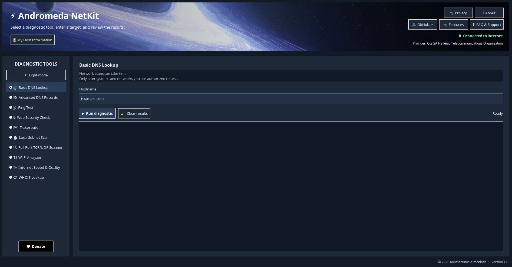

# ⚡ Andromeda NetKit

Andromeda NetKit is a desktop network diagnostics toolkit for Windows, Linux,
and macOS.

## Features

- **Basic DNS Lookup** — resolve a hostname to its IPv4 address.
- **Advanced DNS Records** — query common records such as A, AAAA, MX, NS,
  and TXT.
- **Ping Test** — check whether a host responds.
- **Web Security Check** — see whether a website redirects from HTTP to HTTPS.
- **Traceroute** — inspect the route to a destination, where supported.
- **Local Subnet Scan** — find responding hosts on a `/24` network.
- **Full-Port TCP/UDP Scanner** — probe ports 1–65535 and report their status.
- **Wi-Fi Analyzer** — list nearby wireless networks using operating-system
  tools.
- **Internet Speed & Quality** — measure download/upload speed, latency,
  jitter, and packet loss.
- **WHOIS Lookup** — retrieve domain registration information.
- **My Host Information** — view local network interfaces and addresses,
  subnet prefixes, gateways, DNS, proxy settings, Wi-Fi details, and public
  IPv4/IPv6 addresses.
- **Connection status and ISP display** — periodically check internet
  availability and identify the provider.
- **App conveniences** — switch between light and dark themes, view About and
  Privacy information, open GitHub/support and the feature list, or donate.

Network-dependent features require internet access or the relevant
operating-system tools. Only scan systems and networks you are authorized to
test.

## Run from source

```bash
python3 main.py
```

Install the Python runtime dependencies with:

```bash
python3 -m pip install -r requirements.txt
```

`requirements.txt` includes all external Python libraries used by the app,
including Pillow for the background image.
Tkinter is part of Python's standard library distribution but may need to be
installed separately by your operating system (for example, `python3-tk` on
Debian/Ubuntu). The installers verify Tkinter before building.

The GUI opens maximized with the supplied cosmic wallpaper and planet icon.
Choose Light or Dark mode from the diagnostics panel. PC & Connection
Information does not open automatically; select **My Host Information** when
you want to view local
interfaces and subnet addresses, gateways, DNS, proxy settings, Wi-Fi details,
and public IPv4/IPv6 lookups. Public IP lookups contact api.ipify.org; the
internet provider indicator shares your public IP with ipwho.is to identify
the ISP. The report is shown locally and is not uploaded by the app. The
interface and About dialog credit Konstantinos Aimoniotis and show software
version 1.0. Tool choices include emoji labels.
The Donate button is centered at the bottom of the diagnostics list with a
black background and white text; About and Privacy are grouped on the right
side of the header.

The homepage links to the in-app privacy statement, FAQ/support, the complete
feature list, and the
[GitHub repository](https://github.com/aimoniotis/Andromeda-NetKit).
Support issues open the repository's GitHub Issues page. The footer shows
`© 2026 Konstantinos Aimoniotis`.
The Wi-Fi analyzer uses your operating system's wireless tools. Linux requires
`nmcli` or `iwlist`, Windows uses `netsh`, and macOS uses its built-in AirPort
utilities. Results depend on the adapter, permissions, and OS support.

Internet speed and quality tests require `speedtest-cli` and an internet
connection. The test transfers data to and from a third-party speed-test
server, and uses ping to measure latency, jitter, and packet loss.

The full-port scanner probes TCP and UDP ports 1-65535. A UDP port that does
not respond is reported as `open|filtered`, since a silent response cannot
distinguish an open UDP service from packet filtering. Only scan systems and
networks you own or have explicit permission to test.

## Run the test suite

```bash
python3 -m unittest discover -s tests -v
```

## Install on Linux

These steps build the app from source and install it for your Linux user. You
do not need administrator access for the app installation itself.

### 1. Install system prerequisites

On Debian or Ubuntu:

```bash
sudo apt update
sudo apt install git python3 python3-venv python3-tk
```

For Wi-Fi scanning and ping diagnostics, also install the corresponding
system utilities if they are not already present:

```bash
sudo apt install network-manager iputils-ping traceroute
```

On Fedora, the corresponding packages are typically `git python3
python3-tkinter NetworkManager iputils traceroute`. Package names can differ
between distributions.

### 2. Download the project

Open a terminal and clone the repository:

```bash
git clone https://github.com/aimoniotis/Andromeda-NetKit.git
cd Andromeda-NetKit
```

### 3. Build and install

Run the installer from the project directory:

```bash
bash install_linux.sh
```

The script creates a project-local `.venv`, installs the Python build
requirements from `requirements-build.txt`, builds the standalone app, and
installs it under `~/.local/opt/andromeda-netkit`. It also adds an application
menu entry and icon under `~/.local/share`. The first build needs an internet
connection and may take several minutes. Do not run the installer with `sudo`.

### 4. Launch

Open **⚡ Andromeda NetKit** from your desktop’s application menu. To launch
from a terminal instead:

```bash
~/.local/opt/andromeda-netkit/AndromedaNetKit
```

### Update or uninstall on Linux

To update a source checkout, enter its directory, pull the latest version, and
rerun the installer:

```bash
cd Andromeda-NetKit
git pull
bash install_linux.sh
```

To uninstall, remove the app and its menu/icon files for your user:

```bash
rm -r ~/.local/opt/andromeda-netkit
rm -f ~/.local/share/applications/andromeda-netkit.desktop
rm -f ~/.local/share/icons/hicolor/256x256/apps/andromeda-netkit.png
```

## Install on Windows

These steps build a Windows executable and add a Start-menu shortcut.

### 1. Install prerequisites

Install:

- **Git for Windows** from [git-scm.com](https://git-scm.com/download/win).
- **Python 3** from [python.org](https://www.python.org/downloads/windows/).
  In the installer, enable the Python launcher and Tcl/Tk support. Enabling
  **Add Python to PATH** is recommended.

After installation, open PowerShell and confirm Python is available:

```powershell
py -3 --version
```

### 2. Download the project

In PowerShell, clone the repository and enter its folder:

```powershell
cd $HOME\Documents
git clone https://github.com/aimoniotis/Andromeda-NetKit.git
cd .\Andromeda-NetKit
```

You can use another folder instead of `Documents`; keep the terminal in the
project directory for the next step.

### 3. Build and install

Run the installer:

```powershell
.\install_windows.bat
```

The script creates a project-local `.venv`, installs build requirements,
creates `dist\AndromedaNetKit.exe`, copies the executable to
`%LOCALAPPDATA%\Programs\AndromedaNetKit`, and creates a Start-menu shortcut.
The first build needs an internet connection and may take several minutes.
If Windows asks for confirmation to run the batch file, verify that it came
from this repository before allowing it.

### 4. Launch

Open **Andromeda NetKit** from the Windows Start menu. To build the executable
without installing the Start-menu shortcut, run:

```powershell
.\build_windows.bat
```

The resulting executable is `dist\AndromedaNetKit.exe`.

### Update or uninstall on Windows

To update a source checkout, open PowerShell in its project folder and run:

```powershell
git pull
.\install_windows.bat
```

To uninstall, remove **Andromeda NetKit** from the Start menu if desired, then
delete `%LOCALAPPDATA%\Programs\AndromedaNetKit`. The project checkout and its
`.venv` are separate and can be kept for later builds or removed independently.

## Troubleshooting

- **Linux reports that Tkinter is missing:** install your distribution’s
  Tkinter package (for example, `sudo apt install python3-tk`) and rerun the
  installer.
- **The Linux installer cannot create `.venv`:** install `python3-venv` for
  the Python version used by `python3`.
- **Windows says Tkinter is unavailable:** rerun the Python installer and
  ensure Tcl/Tk support is installed, then retry `.\install_windows.bat`.
- **A Wi-Fi scan returns an error or no networks:** results depend on the
  wireless adapter, operating-system utilities, permissions, and whether
  Wi-Fi is enabled.
- **A diagnostic tool is unavailable:** bundled Python packages do not include
  operating-system utilities such as Linux `ping`, `traceroute`, or `nmcli`.

PyInstaller builds for the operating system on which it runs. Build the Windows
`.exe` on Windows and the Linux executable on Linux; the Linux executable is
not a Windows `.exe`.
